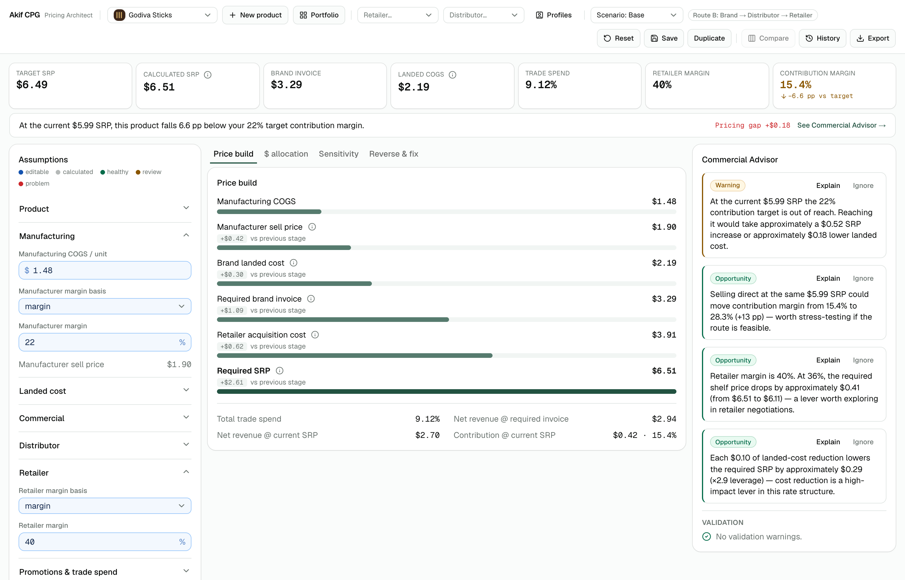

# Akif CPG — Pricing Architect

Pricing, landed-cost and trade-spend planning for CPG brands and manufacturers. It models the
whole value chain — manufacturing COGS → manufacturer margin → freight, duty and tariff → landed
cost → brand → distributor → retailer → shelf price → promotions → contribution margin — and it
runs that chain in **both directions**:

- **Forward:** "my cost is $1.48. What does the shelf price have to be for me to keep 22%?"
- **Backward:** "the retailer will sell it at $6.49. What is the most my landed cost can be?"



Every calculated number is explainable: each one carries a trace with its formula, inputs and
intermediate steps, shown behind a "Show Calculation" dialog.

## Quick start

```bash
npm install
npm run dev
```

Then open <http://localhost:3000>.

To run it without a dev server — the way a non-developer uses it — build the static bundle once
and double-click the launcher:

```bash
npm run export:static
```

Then double-click `Akif-CPG-Baslat.command`, which serves `out/` and opens a browser. Opening
`out/index.html` straight from the filesystem does **not** work: Chrome blocks scripts on
`file://` origins.

| Script | What it does |
| --- | --- |
| `npm run dev` | Development server on port 3000 |
| `npm test` | Vitest suite (all financial logic) |
| `npm run lint` | ESLint |
| `npm run build` | Production build |
| `npm run export:static` | Static bundle into `out/` |

## Where your data lives

Everything is stored in **your browser's localStorage**. There is no backend, no account and no
network call — which also means nothing is shared between people or between machines, and
clearing site data erases your work. Use **Export** to take a scenario out as CSV.

## How the code is organised

```
lib/pricing-engine/   All financial math. Pure, unit-tested, Decimal.js.
lib/scenario/         Composition layer: form state, computeScenario, products, seeds, export.
lib/import/           Spreadsheet template: schema, pure parser, ExcelJS bridge.
lib/repository/       Persistence boundary. localStorage today, swappable later.
components/pricing/   Main screen: top bar, summary cards, assumptions, tabs, advisor.
components/setup/     Product wizard. components/portfolio|profiles|benchmarks/ — the rest.
components/ui/        shadcn primitives (Base UI under the hood).
docs/                 PRD (the source of truth) and Turkish user guides.
```

### Rules that are not negotiable

These exist because pricing bugs are silent and expensive. A change that breaks one of them is a
bug even if the tests pass:

1. **All financial math lives in `lib/pricing-engine/`.** No formulas inside React components.
2. **Decimal.js for every money and percentage calculation** — never raw JS floats. Rates are
   stored as decimal fractions (15% is `0.15`); the UI converts at the input boundary only.
3. **Margin ≠ markup.** Every margin field carries an explicit basis. `margin` = profit ÷ selling
   price → `price = cost / (1 − m)`. `markup` = profit ÷ cost → `price = cost × (1 + m)`. On a
   $8.00 cost, 20% margin is $10.00 and 20% markup is $9.60. Never conflate them.
4. **Never round intermediates.** Rounding happens at display time in `lib/scenario/format.ts`.
5. **The Advisor recommends, it never changes an input by itself.** Suggestions require an
   explicit Apply from the user.
6. **Benchmarks and planning bands are editable data records**, never hardcoded strings in
   components, and the language is always guidance ("a range worth stress-testing"), never advice.

### Acceptance tests

These four must always pass — they are the contract with the PRD:

| Case | Input | Expected |
| --- | --- | --- |
| Margin | COGS $8, 20% margin | $10.00 |
| Markup | COGS $8, 20% markup | $9.60 |
| Retailer SRP | landed $10, 50% retailer margin | $20.00 |
| Trade spend | 52 wks; BOGO 4 wks/50%/2.0x + OI 8 wks/15%/1.25x, both fully brand funded | ≈9.48% |

## Contributing

1. Branch off `main`.
2. Before opening a PR, all three must be clean: `npm test`, `npm run lint`, `npm run build`.
3. Tests are written with or before engine code, never retrofitted after the UI.
4. If a change is visible in the app, check it in a browser — several real bugs in this project
   were only ever caught that way, never by the test suite.
5. Keep commits small, with a body explaining what changed and why.

**Read [CLAUDE.md](CLAUDE.md) before your first change.** It carries the locked decisions, the
roadmap, and the accumulated gotchas — the kind of thing that costs an afternoon to rediscover
(Base UI's `render` prop instead of `asChild`, why `PersistedState.version` must stay `1`, why
synthetic input events silently no-op in the production build). It is written for AI coding
agents but reads perfectly well as engineering notes.

## Documentation

- [docs/PRD.md](docs/PRD.md) — the full product spec. The source of truth for behaviour.
- [docs/Akif-CPG-Ornek-Rehber-Godiva-Sticks.pdf](docs/Akif-CPG-Ornek-Rehber-Godiva-Sticks.pdf) —
  a landscape walkthrough (Turkish) that teaches every screen through one worked example.
- [docs/Akif-CPG-Kullanim-Kilavuzu.pdf](docs/Akif-CPG-Kullanim-Kilavuzu.pdf) and
  [docs/Akif-CPG-Ne-Ise-Yarar.pdf](docs/Akif-CPG-Ne-Ise-Yarar.pdf) — user guide and plain-language
  introduction (Turkish).

## Status

The MVP is complete: 293 tests green, lint clean, production build and static export pass.

Deferred by decision, not oversight: authentication and multi-tenancy (`lib/repository/` is the
seam that makes a Postgres/Supabase backend a drop-in), promo ROI, the advanced trade-spend
engine (scanback vs off-invoice vs billback mechanics), and the promotion calendar view.

The example data shipped with the app — "Godiva Sticks", the retailer and distributor profiles —
uses representative planning assumptions, not any company's real trade terms.

## Stack

Next.js (App Router) · TypeScript strict · Tailwind CSS · shadcn/ui on Base UI · Recharts ·
React Hook Form · Zod · Decimal.js · ExcelJS (lazy-loaded) · Vitest.
